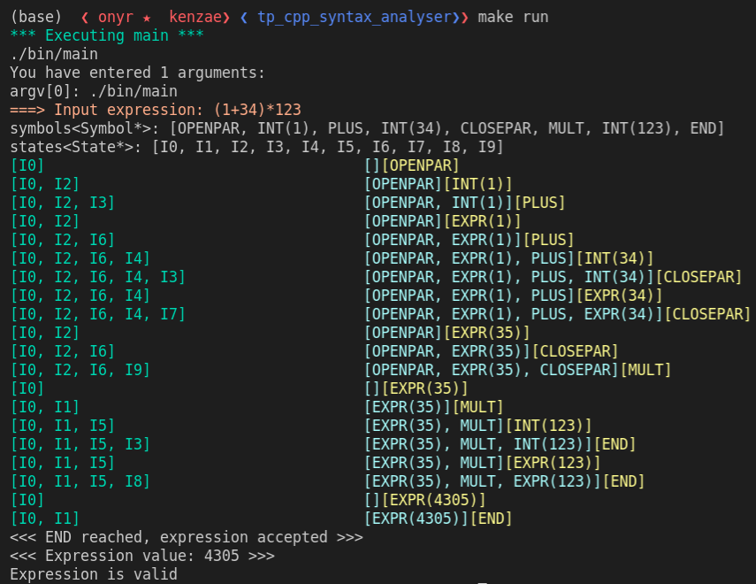
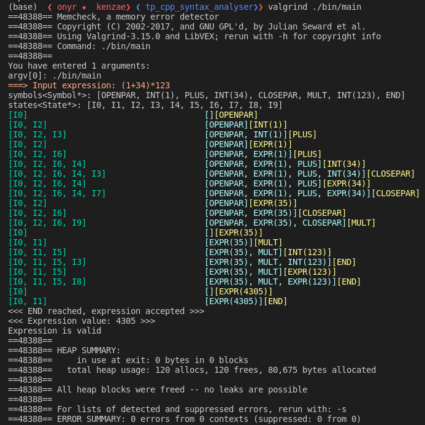

# Ascending Syntax Parser LR(1)

This project is a **specific LR(1) (LALR optimized) Ascending Syntax Parser** for the grammar provided in the subject (see `docs/sujet_tp.pdf`).

> circular imports, templating, template specialisation, state DP, singleton DP, GDB debugging

> [GitHub repo](https://github.com/0nyr/ascending-syntax-parser)



This program has been tested and built for Linux (tested on Ubuntu 20.04).

### Useful links

[solve circular imports](https://pvigier.github.io/2018/02/09/dependency-graph.html)

[Use GDB debugger](https://www.bitdegree.org/learn/gdb-debugger)

## Compile and run

To run the main program:

1. `make dirs` inside the root folder of the project.
2. `make` or `make build`
3. Run the program directly using `./bin/main <expression>` or use `make run`.

To run the tests:

1. `make build_test` or `make all`
2. Run the program using `./bin/test` or `make run_test`.

## Notes

##### valgrind

Program tested with valgrind. No leak detected.




```shell
(base)  ❮ onyr ★  kenzae❯ ❮ tp_cpp_syntax_analyser❯❯ valgrind ./bin/main 
==48388== Memcheck, a memory error detector
==48388== Copyright (C) 2002-2017, and GNU GPL'd, by Julian Seward et al.
==48388== Using Valgrind-3.15.0 and LibVEX; rerun with -h for copyright info
==48388== Command: ./bin/main
==48388== 
You have entered 1 arguments:
argv[0]: ./bin/main
===> Input expression: (1+34)*123
symbols<Symbol*>: [OPENPAR, INT(1), PLUS, INT(34), CLOSEPAR, MULT, INT(123), END]
states<State*>: [I0, I1, I2, I3, I4, I5, I6, I7, I8, I9]
[I0]                                    [][OPENPAR]
[I0, I2]                                [OPENPAR][INT(1)]
[I0, I2, I3]                            [OPENPAR, INT(1)][PLUS]
[I0, I2]                                [OPENPAR][EXPR(1)]
[I0, I2, I6]                            [OPENPAR, EXPR(1)][PLUS]
[I0, I2, I6, I4]                        [OPENPAR, EXPR(1), PLUS][INT(34)]
[I0, I2, I6, I4, I3]                    [OPENPAR, EXPR(1), PLUS, INT(34)][CLOSEPAR]
[I0, I2, I6, I4]                        [OPENPAR, EXPR(1), PLUS][EXPR(34)]
[I0, I2, I6, I4, I7]                    [OPENPAR, EXPR(1), PLUS, EXPR(34)][CLOSEPAR]
[I0, I2]                                [OPENPAR][EXPR(35)]
[I0, I2, I6]                            [OPENPAR, EXPR(35)][CLOSEPAR]
[I0, I2, I6, I9]                        [OPENPAR, EXPR(35), CLOSEPAR][MULT]
[I0]                                    [][EXPR(35)]
[I0, I1]                                [EXPR(35)][MULT]
[I0, I1, I5]                            [EXPR(35), MULT][INT(123)]
[I0, I1, I5, I3]                        [EXPR(35), MULT, INT(123)][END]
[I0, I1, I5]                            [EXPR(35), MULT][EXPR(123)]
[I0, I1, I5, I8]                        [EXPR(35), MULT, EXPR(123)][END]
[I0]                                    [][EXPR(4305)]
[I0, I1]                                [EXPR(4305)][END]
<<< END reached, expression accepted >>>
<<< Expression value: 4305 >>>
Expression is valid
==48388== 
==48388== HEAP SUMMARY:
==48388==     in use at exit: 0 bytes in 0 blocks
==48388==   total heap usage: 120 allocs, 120 frees, 80,675 bytes allocated
==48388== 
==48388== All heap blocks were freed -- no leaks are possible
==48388== 
==48388== For lists of detected and suppressed errors, rerun with: -s
==48388== ERROR SUMMARY: 0 errors from 0 contexts (suppressed: 0 from 0)
```

##### template specialization

[Multiple definition of template specialization](https://stackoverflow.com/questions/4445654/multiple-definition-of-template-specialization-when-using-different-objects)

When using template specialization, the specializations must be declared after the generic one. To be able to include the template in multiple files, use the keyword `inline` in the specializations to make the compiler understand that the symbol will be present in more than one object file without violating the One Definition Rule.
